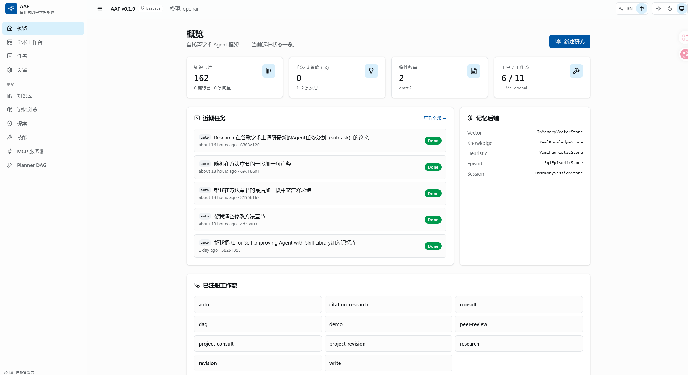
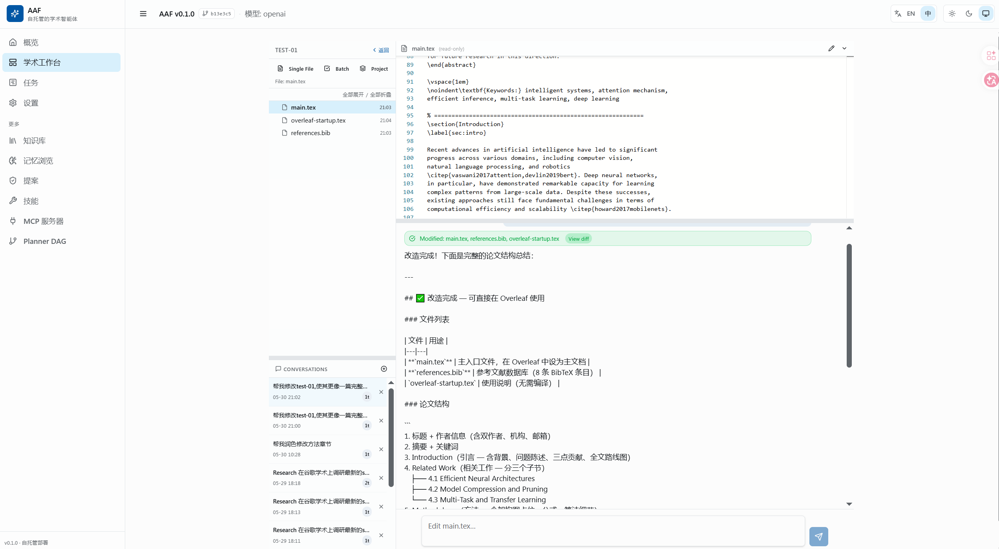
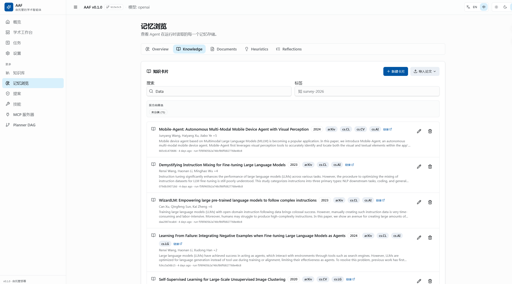

# Academic Agent Framework (AAF)

[English](#) | 中文

**开箱即用的学术智能助手。** 把文献调研、论文写作、审稿修订、引用管理交给 Agent —— 你只需要告诉它要做什么。

An open-source, local-first academic agent. Tell it what you need — literature surveys, paper drafts, peer reviews, rebuttals — and the Agent figures out the rest.

---

## 💡 为什么需要 AAF？

| 痛点 | AAF 方案 |
|------|----------|
| 文献调研耗时 2-4 周，逐篇搜索+阅读+整理 | Agent 自动搜索→结构化笔记→生成综述，2-3 天完成初步调研 |
| 论文写作卡在结构和大纲，不知如何组织 | 输入研究方向，Agent 生成完整大纲+逐节草稿+引文建议点 |
| 投稿前心里没底，不知道 Reviewer 会挑什么毛病 | Agent 模拟顶会审稿人，三阶段评审+偏倚检测+谬误审计 |
| 收到审稿意见后不知如何得体回复 | Agent 分析意见→选择回复策略→生成专业回复信函 |
| 论文修改时不确定该优先改什么 | Agent 分级诊断（必改/应改/可选），给出逐项修改方案 |
| 引文管理混乱，PDF 散落各处 | Agent 自动提取引用→检索每篇→生成结构化论文卡片+知识库 |

---

## 🚀 快速开始（Windows）

### 前置条件

- **Python 3.11+**：[python.org](https://www.python.org/downloads/) 下载，安装时勾选 **"Add to PATH"**
- **Node.js 18+**：[nodejs.org](https://nodejs.org/) 下载安装

### 一键安装

```bash
# 1. 下载本项目并解压
# 2. 双击运行
install.bat
# 3. 编辑 .env 文件，填入你的 API Key
# 4. 双击启动
start.bat
# 5. 浏览器自动打开 → 开始使用
```

安装完成后，桌面会出现 **AAF-Start** 和 **AAF-Stop** 快捷方式，之后一键启停。

### 配置 API Key

编辑项目根目录的 `.env` 文件：

```ini
OPENAI_API_KEY=sk-your-api-key
OPENAI_BASE_URL=https://api.deepseek.com/v1
OPENAI_DEFAULT_MODEL=deepseek-v4-flash
```

支持的模型厂商：**DeepSeek**（推荐，国内直连无需代理）、**OpenAI**、**Anthropic**、**Ollama 本地模型**，以及任何兼容 OpenAI/v1 接口的服务。

### 停止服务

双击桌面 **AAF-Stop**，或运行 `stop.bat`。

---

## 📸 界面一览

### 主工作台 — 对话即操作



在统一的工作台界面中完成所有学术任务。左侧对话区输入需求，Agent 自主调用工具和知识库，右侧预览执行结果。

### 稿件工作台 — 论文编辑与修订



选中稿件后，可以对论文进行咨询、编辑、修订、评审。Agent 理解论文全文，支持单文件修改和批量改写。

### 论文卡片 — 知识库管理



所有调研过的论文自动归入知识库。每篇论文包含 BibTeX、摘要、结构化笔记、与其他论文的关联。支持标题、作者、关键词搜索。

---

## ✨ 功能一览

Agent 会根据你的需求自动选择工具和执行策略。以下是你**可以做什么**——不需要关心内部用哪个 Skill。

### 🔬 文献调研

**告诉 Agent 你的研究问题，它会自主完成：**

- 多源检索（arXiv + Google Scholar），自动去重排序
- 三遍阅读法精读论文（扫读→精读→批判性阅读）
- 生成结构化笔记（核心方法、关键结果、局限性、与其他论文的关联）
- 发现饱和后自动收束，生成综述报告

**典型用法**：在工作台输入 "帮我调研多任务强化学习在机器人操作中的应用"，Agent 自动完成全流程。

---

### ✍️ 论文写作

**从研究方向到完整草稿，Agent 辅助每一步：**

- 根据研究问题生成全篇大纲（7 段式结构，适配 ICLR/NeurIPS/ACL 等顶会）
- 逐节生成详细草稿，含样板文本、引文建议点、常见错误提醒
- 自动检查内容连贯性、论证链条、术语一致性
- 输出 Markdown 或 LaTeX，可直接复制到 Overleaf

**典型用法**：在工作台输入 "帮我给 RoutingRL 这篇论文写 Introduction，目标会议 ICLR"。

---

### 🔍 投稿前自审（模拟审稿）

**把论文交给 Agent，它会像顶会 Reviewer 一样审查：**

- 三阶段评审：初步评估 → 逐节详细审查 → 方法论与统计严谨性
- 偏倚检测：确认偏倚、选择偏倚、发表偏倚、P-hacking
- 逻辑谬误识别：事后归因、相关≠因果、草率泛化、选择性报告、稻草人论证
- 输出结构化审稿报告（优点 / 致命问题 / 次要问题 / 修改建议 / 投稿决策）

**典型用法**：选中稿件 → 输入 "帮我用顶会审稿人的视角审一下这篇论文"。

---

### 📝 论文修订

**收到审稿意见或导师反馈后，Agent 帮你系统化处理：**

- 解析每条反馈的真实关切，诊断问题类型（实质缺陷 / 表达不清 / 建议）
- 分级修改方案：必改（影响核心论证）→ 应改（学术严谨性）→ 可选（文笔提升）
- 逐节分析 + 具体编辑示例（原文 → 修改版 → 解释）
- 输出修改检查清单，追踪修改进度

**典型用法**：在工作台粘贴审稿意见 → Agent 生成修改指南。

---

### ✉️ 审稿回复

**自动生成专业的 Rebuttal Letter：**

- 分析每条审稿意见的真实意图
- 三策略自动选择：澄清（误解） / 防守（有证据反驳） / 认可（有效关切）
- 生成标准格式回复信函（开场白 + 逐项回复 + 修改总结 + 结语）
- 每条回复包含：问题评估 → 回复正文 → 论文中对应的修改位置

**典型用法**：有了论文修改稿后，输入 "帮我生成对 Reviewer 意见的回复信"。

---

### 📚 引文调研

**上传一篇论文 PDF，Agent 帮你梳理整个引用网络：**

- 自动提取参考文献列表
- 逐篇检索每一篇被引论文（Google Scholar / arXiv）
- 生成结构化论文卡片，存入知识库
- 构建论文引用关系图

**典型用法**：在工作台选中 PDF → Agent 自动提取和检索所有引用。

---

### 🧠 知识库管理

**所有调研成果自动积累，越用越强：**

- 论文卡片：标题、作者、摘要、BibTeX、阅读笔记、与其他论文的关联
- 向量搜索：用自然语言查找相关论文
- 调研状态持久化：关闭后下次继续，不丢失上下文
- 支持从论文卡片直接跳转到原文和笔记

---

### 🎨 学术 PPT 制作

**基于论文内容自动生成演示文稿：**

- 提取论文核心论点，生成 PPT 大纲
- 逐页生成内容（背景、方法、实验、结论）
- 支持导出为 PPTX 格式

**典型用法**：选中论文 → 输入 "帮我把这篇论文做成 PPT"。

---

### 💬 稿件咨询

**像和导师讨论一样，直接向你的论文提问：**

- "我的 Introduction 和 Related Work 有没有重复内容？"
- "这个实验设计有没有遗漏基线？"
- "第三节的论证链条是否完整？"

Agent 会通读全文后给出针对性回答。

---

## 🆚 与其他工具的区别

| | AAF | ChatGPT + 插件 | Elicit / Consensus | Paperpal |
|---|---|---|---|---|
| **本地优先** | ✅ 数据在自己电脑上 | ❌ 数据上传云端 | ❌ 数据上传云端 | ❌ 数据上传云端 |
| **端到端自动化** | ✅ 调研→写作→修订→回复 全链路 | ❌ 单次问答，无流程串联 | ⚠️ 仅文献发现 | ⚠️ 仅语言润色 |
| **模型自由选择** | ✅ DeepSeek / OpenAI / Anthropic / Ollama | ❌ 仅 OpenAI | ❌ 固定模型 | ❌ 固定模型 |
| **审稿模拟** | ✅ 三阶段 + 偏倚检测 + 谬误审计 | ❌ | ❌ | ❌ |
| **审稿回复** | ✅ 策略选择 + 自动生成回复信 | ❌ | ❌ | ❌ |
| **知识库积累** | ✅ 论文卡片 + 关联图谱 + 跨会话记忆 | ❌ 无持久化 | ⚠️ 仅收藏 | ❌ |
| **开源可定制** | ✅ MIT 开源 | ❌ | ❌ | ❌ |
| **费用** | 仅 API 费用（DeepSeek 极低） | $20/月 + API | 免费额度有限 | 订阅制 |

---

## ❓ 常见问题

<details>
<summary><b>需要什么样的 API Key？费用如何？</b></summary>

推荐使用 **DeepSeek**（[platform.deepseek.com](https://platform.deepseek.com)），注册即送额度，API 价格极低。也支持 OpenAI、Anthropic、以及 Ollama 本地模型（完全免费）。
</details>

<details>
<summary><b>Google Scholar 在国内访问不了怎么办？</b></summary>

Agent 内置多端点自动 fallback 机制，会依次尝试多个镜像站点。如果全部不可用，Agent 会自动降级到 arXiv 检索。
</details>

<details>
<summary><b>我的论文数据安全吗？</b></summary>

AAF 是**本地优先**架构，所有论文、笔记、稿件都存储在你电脑的 `data/` 文件夹中。不会上传到任何云端服务。你可以随时备份这个文件夹。
</details>

<details>
<summary><b>能否自定义 Agent 的行为？</b></summary>

可以。打开 Web 界面的 **Settings** 页面，直接编辑 Agent 的系统提示词（`presets/chat.md`），修改后即时生效。你也可以添加自定义 Skill（在 `skills/` 目录下新建 `SKILL.md` 文件即可，重启后自动发现）。
</details>

<details>
<summary><b>支持哪些论文格式？</b></summary>

支持 PDF、DOCX、Markdown、LaTeX (.tex) 格式的论文阅读和编辑。输出可选择 Markdown 或 LaTeX。
</details>

<details>
<summary><b>端口被占用怎么办？</b></summary>

默认前端端口 `5173`，后端端口 `8000`。如果被占用，编辑 `start.bat` 修改端口号，同时修改前端 `.env` 中的后端地址。
</details>

---

## 📄 许可证

[MIT License](LICENSE)

---

<p align="center">
  <b>Academic Agent Framework</b> — 让 Agent 处理学术苦力活，你专注于研究本身。
</p>
